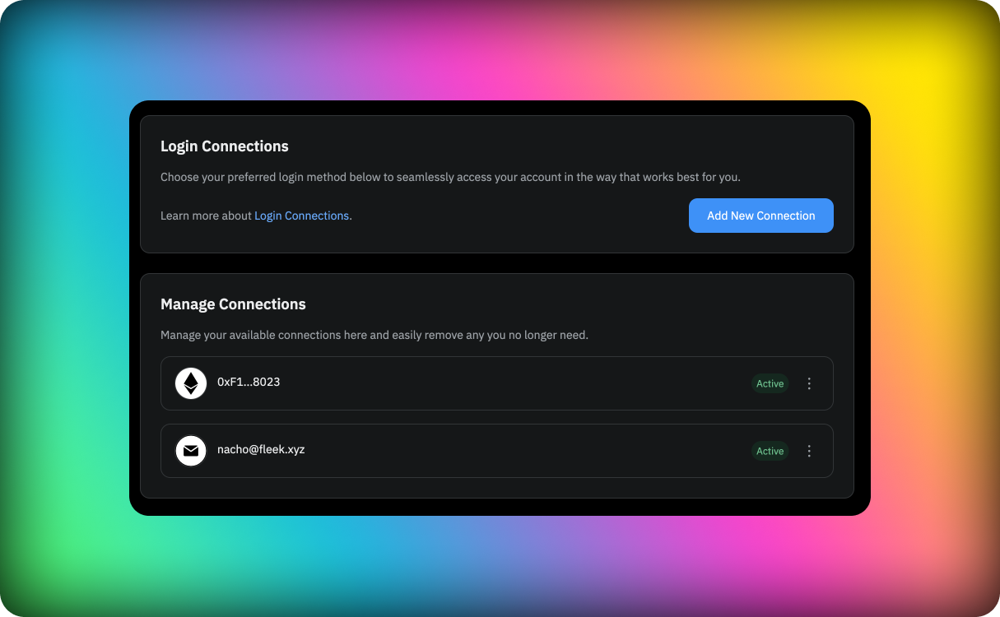

### Authentication

We use [Dynamic.xyz](https://dynamic.xyz) for authentication, this means that you can use any of the following methods to authenticate in Fleek:

- Wallet Authentication
- Email Authentication (using OTP)

#### Managing your login connections

You can manage your login connections from the account settings page in the login connections sections. You can add a login connections at any moment by clicking on the add button and selecting the method you want to add. Currently the application supports multiple wallets but you can only have one email linked to your account as an authentication method.

You can also remove (or edit in the case of an email) any of the login connections you have added to your account. To do this you will need to click on the three doted menu and select the option to unlink the connection. This will open the [Dynamic.xyz](https://dynamic.xyz) modal where you will be able to unlink the connection.

### Username

In Fleek we use usernames to identify users we will be using this in internal comunications and also in the UI. The username can be changed at any moment.

### Email

Email in Fleek is not mandatory but it is highly recommended to have one associated with your account as our notification system will use it to send you important information about your account and projects.

### Deleting an account

At any moment you can delete your account, this will delete all the projects and data associated with it. This action is irreversible. If you want to delete your account, you can do it from the account settings page.
