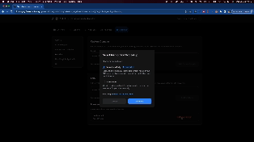
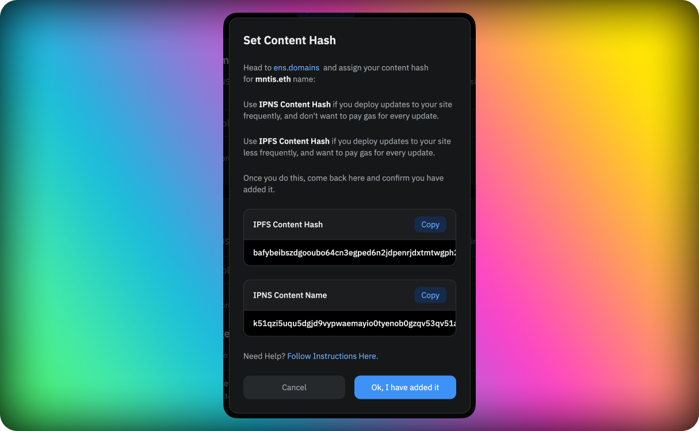

### Introduction

[Ethereum Name Service Domains](https://ens.domains/es/) provide a decentralized alternative to DNS domains. These are Ethereum based names followed by the .eth TLD. One of its great features is its capability to map multiple records with multiple purposes.

For example, an IPFS content hash or IPNS record from a site you uploaded with Fleek, to have that name.eth resolve to that content (much like any DNS domain maps to an html file!). For example, [Eth Limo](https://ens.eth.limo/).

#### ENS Name Resolving

Given ENS names and their resolving live on Ethereum, for a user to resolve/visit an ENS domain they will need to have a compatible provider/browser installed that is able to resolve them. Using the MetaMask browser extension is one option, as it resolves .eth domains. An alternative is using a public gateway such as ETH Limo!

Which by appending .limo at the end of your ENS simply resolves it via HTTPS.

### Adding an ENS domain

To add an ENS domain to your site, first you need to have a site created. If you don't have a site yet, please follow the steps in the [Sites](/docs/Sites) section.

Once you have a site created, go to the site overview and click on the settings icon. In the settings page, click on the **Domains** tab. You will see a list of all the ENS you have added to the site. To add a new ENS domain, type it into the input available in the ENS domains section and after we run some validations (mainly checking that the domain is valid and is not added to another site) you will be able to add it by clicking the **Add ENS Domain** button.

When the ENS domain is added you will be prompted with a modal to select your preffered method for setting up the ENS content hash record. You can choose between:

- **Automatic**: This will require you to sign a transaction directly from the Fleek application.
- **Manual**: This will allow you to manually set the ENS content hash record directly from the ENS application..

:::note
We recommend using the automatic method as it is the easiest and fastest way to set up your ENS domain.
:::

### Automatic ENS configuration

When going for the automatic option you will have to select between using IPNS or IPFS as the content hash record. We recommend using IPNS for sites that are going to be updated frequently as this means not paying gas on every update. If you are not going to update your site frequently and are ok on paying gas to update the content hash on every deploy, you can use IPFS as the content hash record.


After selecting the desired option, you will be prompted with a modal to sign a transaction from your wallet. For this you will need to have the wallet that owns the ENS domain connected to the Fleek application. It is important that when linking the wallet you also select it as your main wallet in the Dynamic modal by clicking on the [...] menu and click the option **Select wallet**.



Once the transaction is signed and validated, your site will be set and ready on your ENS domain! To access it you can either use a compatible browser extension such as MetaMask or use a public gateway such as ETH Limo by appening the .limo TLD to your ENS domain.

### Manual ENS configuration

When going for the manual option you will be prompted with a modal with instructions on how to set the ENS content hash record manually. You will need to follow the instructions and set the content hash record manually from the ENS application. You can either select between using IPNS or IPFS as the content hash record. We recommend using IPNS for sites that are going to be updated frequently as this means not paying gas on every update. If you are not going to update your site frequently and are ok on paying gas to update the content hash on every deploy, you can use IPFS as the content hash record.



The next step is to go to the ENS application and set the content hash record manually.

#### Set up the ENS Content Record manually

With the edit and management view enabled, you will be able to scroll down to the records section and click ADD/EDIT RECORD. Scroll down to the CONTENT field and enter:


For an IPNS name:

```
ipns://yourhash
```

For example

```
ipns://k51qzi5uqu5dj4m3cwuo6mezt5j3zdx6euck56nab99rt1onxo9y0nwbmcgoAA
```

For an IPFS name:

```
ipfs://yourhash
```

For example

```
ipfs://k51qzi5uqu5dj4m3cwuo6mezt5j3zdx6euck56nab99rt1onxo9y0nwbmcgoAA
```

Once set, scroll down to confirm and validate the Ethereum transaction with your wallet. When the transaction is validated, your site will be set and ready on your ENS domain!

To finalize the process you need to go back to the Fleek application and click the **Ok! I have added it** button. We will run a verification thta the content hash was setted up correctly and if everything is ok, you will see the ENS domain marked as verified. 

To access it you can either use a compatible browser extension such as MetaMask or use a public gateway such as ETH Limo by appening the .limo TLD to your ENS domain.

### Manually Adding an ENS Subname

Normally, trying to add an ENS subdomain or Subname of ENS V3 can trigger an errors due to controller settings in ENS. To ensure you can easily add any ENS subdomain to any Fleek site you want, go to the ENS app at https://app.ens.domains/yourname and:

1. Visit the subnames tab, and select the subname you want to add to Fleek.
2. Unwrap your subname.
3. Set it as a primary name.
4. Done! Go back to Fleek, and follow the normal ENS flow.