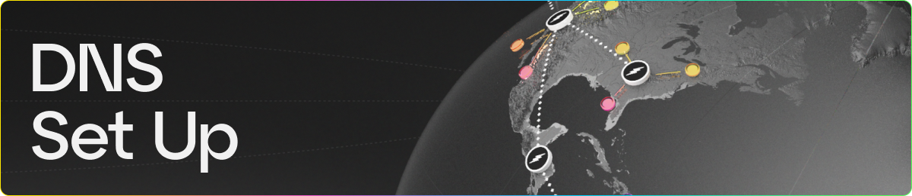

### Introduction

In this guide we will be going over key aspects to set up your DNS records correctly when using Fleek Custom Domains with your Fleek site.

#### DNS Records

Depending on the use case you want to achieve, you will need to set up different DNS records thus impacting on the DNS provider you might need.

#### Root Domains

If you want to use a root domain, you will need to set up a ANAME record pointing to the pull zone that was provided by Fleek.

Not all DNS providers support ANAME records so you might need to change providers, some providers that support ANAME records are:

- Cloudflare
- DNS Made Easy
- DNSimple
- CONSTELLIX
- DYN DNS
- Easy DNS
- NS1

Some of this providers like Cloudflare user CNAME and ANAME interchangeably, so if you are using Cloudflare you can use a CNAME record instead.

#### Subdomains

If you want to use a subdomain, you will need to set up a CNAME record pointing to the pull zone that was provided by Fleek. Since CNAME records are supported by most DNS providers, you should be able to use any DNS provider.

We do recommend using a DNS provider that supports ANAME records since it will make the setup process easier if in the future you might use a root domain.

